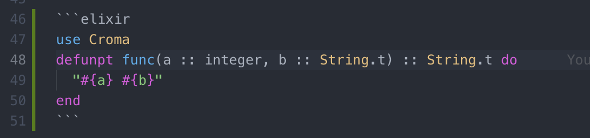

# ElixirTinyLS

Additional Elixir language support for markdown code block and Croma

## Features

- Elixir syntax highlighting in fenced code blocks in markdown files.
- Highlight `defun`, `defunp`, `defunpt` of [Croma](https://github.com/skirino/croma).

## Requirements

- [vscode-elixir](https://github.com/fr1zle/vscode-elixir)

## Extension Settings

None for now...

## Known Issues

None for now...

## Release Notes

- 0.0.1
  - initial release
